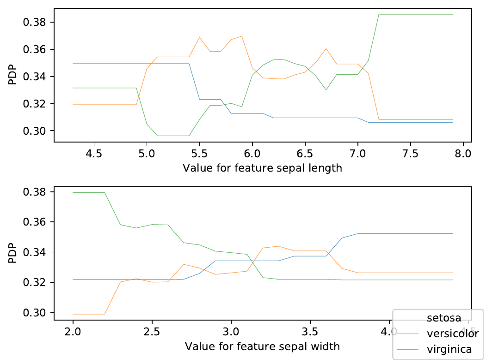

# Intepretability engine

Interpret your black-box model deployed in [Serving Engine](https://docs.ovh.com/fr/serving-engine/)



## Installation

```
pip3 install .
```

## Usage

```
interpretability-engine --token XXX --deployment-url https://localhost:8080 --samples-path my_dataset.csv --features 0 1 2 --method 'pdp'
```
**Note**:
  - Instead of using a local csv file, you can use `swift` with the right paramters to retrieve the samples
  - You can save the result of the interpretation with `--output-file`
  - Type `interpretability-engine -h` or check `misc/integration-tests.sh` to have more information

[PDP method](https://scikit-learn.org/stable/modules/partial_dependence.html)
